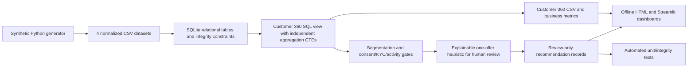

# Architecture and analytical methodology

## System diagram

## Relational grain and joins

| Table | Grain/key | Main fields | Purpose |
|---|---|---|---|
| `customers` | one row per `customer_id` | region, consent flag, DNC, KYC, onboarding | Simulated master data |
| `accounts` | one row per `account_id`, **one per customer in prototype** | type, status, snapshot balance | Account master |
| `product_holdings` | one row per customer-product pair | code, active/closed | Current product footprint |
| `transactions` | one row per `transaction_id` | date, direction, status, amount | Simulated activity |
| `customer_360` | one row per `customer_id` | consolidated fields + derived KPIs | Analyst-facing view |
| `recommendations` | zero/one row per `customer_id` | proposed product, index, rationale, review state | Human-review worklist |

Foreign keys link accounts/products to customers and transactions to accounts. The `customer_360` view first aggregates transactions by `account_id` and active product holdings by `customer_id`, then joins these one-row results to the customer/account tables. Joining raw transactions directly to holdings would fan out a customer's purchases when they hold multiple products, producing incorrect totals.

## KPI definitions

| Field | Calculation / interpretation |
|---|---|
| `successful_txn_90d` | Count of `SUCCESS` transaction records dated 2026-07-01 to 2026-09-30 |
| `credit_inflow_90d_inr` | Sum of successful CREDIT transaction amounts in that period |
| `debit_outflow_90d_inr` | Sum of successful DEBIT transaction amounts in that period |
| `salary_credit_count_90d` | Number of successful SALARY transaction records in that period |
| `salary_inflow_90d_inr` | Sum of successful SALARY amounts in that period |
| `returned_txn_90d` | Number of RETURNED transactions (not treated as successful cash flows) |
| `last_successful_txn_date` | Most recent successful transaction as of the reference date |
| `inactive_over_60d` | 1 if last transaction is absent or >60 days before 2026-09-30 |
| `balance_segment` | Illustrative grouping based on separately simulated account snapshot |
| `contactable_for_review` | 1 if consent=1, do_not_contact=0, KYC=VERIFIED and account=ACTIVE |
| `review_only_opportunities` | Count of rule-based records in recommendations table, not completed sales |

A customer may pass `contactable_for_review` yet be excluded later for inactivity/returned transactions. Product penetration is `holders / total customers`, not a measure of customer satisfaction or bank profit. Financial transaction volume is not bank revenue.

## Recommendation algorithm (educational only)

For each Customer 360 row:

1. Reject from the suggestion worklist when basic simulated marketing consent, KYC/account, activity or return checks fail. This is a prototype filter, not proof of regulatory compliance.
2. Consider **FD conversation** when a savings customer has no active FD and their independently simulated snapshot balance is at least ₹80,000.
3. Consider **credit-card conversation** when a savings customer has no active card, has at least two successful salary credits in the last three months, and has salary inflows averaged over three calendar months of at least ₹35,000/month.
4. Calculate a simple bounded sorting index. FD: `min(100, 50 + min(30, floor((snapshot_balance-80000)/5000)) + min(20, successful_txn_90d))`. Card: `min(100, 50 + min(30, floor(average_monthly_salary_inflows/4000)) + min(20, successful_txn_90d))`.
5. Select at most one product per customer using the higher score (alphabetical product code breaks ties). Insert with `approval_status='REVIEW_REQUIRED'` and an explanatory note.

These index values are heuristic priorities, **not** conversion predictions, affordability scores, risk scores, suitability decisions or probability estimates. The two score formulas are illustrative and not calibrated against each other or real outcomes. A real bank would use approved governance, legal and suitability checks, verified source data and authorized review.

## Reproducibility

- Data generator: seed `20261002`; 1,500 fictional customers; Jan–Sep 2026 transactions.
- Analytics snapshot: 30 September 2026; last three complete months (Jul–Sep).
- Database: regenerated from scratch each run; SQLite FK checks and value constraints.
- Test command: `python -m unittest discover -s tests -v`.
- Offline dashboard: `python run_pipeline.py` creates `dashboard/index.html` with Plotly JS embedded.